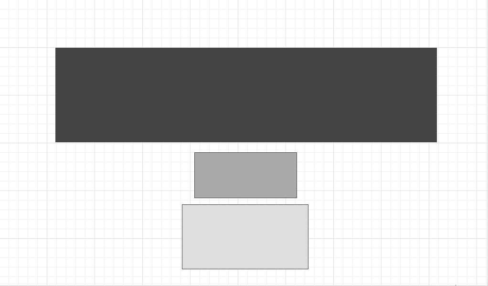
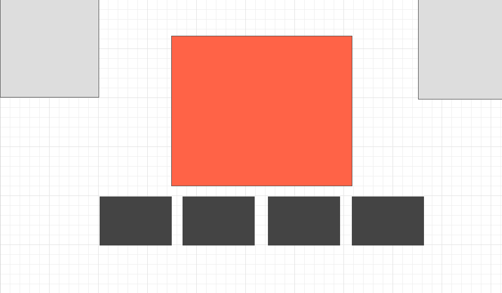

# Sports-Logos-Game

Approach:

First off, I wanted to do this how I thought a programmer would do it -- take care of the functionality first, make sure it works and then tackle the CSS. And I think that was a sound approach for me, because I could see myself going back and forth between the functionality and the css so often to the point where it'd slow me down. 

I also wanted to set my game up dynamically through jQuery, while creating as few elements in my HTML file as possible. Making two HTML files crossed my mind, but I chose to set it up similar to a homework assignment we did with the racers, and change the background and hide some elements from the landing page instead. 

Functionality: On the landing page, the "How To Play" button displays a modal with the instructions. Once the user clicks the "Wanna Play?" button, he/she is taken to the game page where everything happens. Click "Begin", and the timer gets set to 45 seconds and the first logo pops up. From there, you have 45 seconds to get as many correct answers as possible out of 20. The score card in the top right box keeps track of where you are in the game. If you get all 20, you win! If not, an alert pops up booing you. 

I set everything up via jQuery. I wrote out the array of objects, randomized that AND the multiple choice questions. Instead of using two HTML files, I decided to create my game page through jQuery by changing the background, hiding the elements from the landing page and creating new ones for the game page. 

Setup: 

My goal was to have a large array of objects, each having a logo image and a corrsesponding team name. The original plan was to have an input box for the user to type in his/her guesses. But I didn't factor in all the things that could go wrong there -- the user typing in lowercase or uppercase or typos -- and decided to turn it into a multiple choice game with three wrong answers and a correct one to go with the sports team logo that was displayed. But my biggest issue at the beginning was setting up my functions and figuring out which elements I should create with global scope. I thought I did a better job at pseudo coding this time around, which was a big help in structuring my code and making it clean. 

Keeping it dry was a whole other problem later on when I was making progress. It took some time condensing my code into cleaner functions that worked. 

Managed to randomize both the logos array so it shows up in a different order every time, plus the answers so the correct option doesn't show up in the same order every time. 

Unsolved Problems: 

My reset button that takes the user back to the landing page is a bit wonky -- couldn't figure that out. I think it would've been easier to pull off if I had used two HTML files but I was in too deep already. Also, making the timer showing up is a bit delayed. 

I wasn't able to get to my reach goals of developing a scoring system and storing scores with local storage. I really would like to learn how to do that. 

When the plan was to have an input box for the user to type his/her answer in, matching the user's guess with the key/value pair in the array seemed impossible. 

Sometimes the alert that's supposed to pop up when time runs out pops up unexpectedly when you're on another tab or application all together. 

Wireframes:

